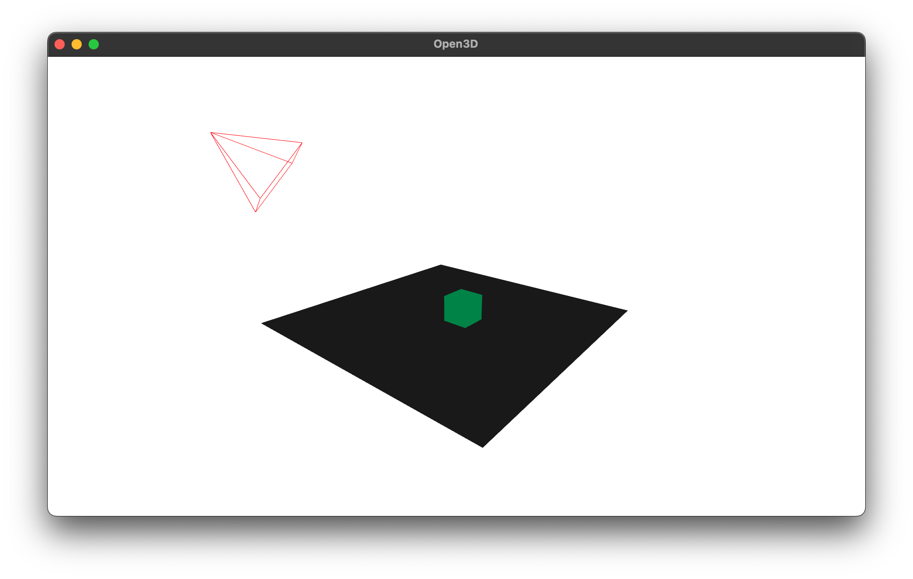
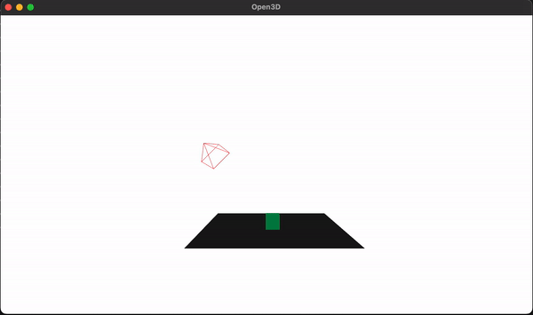

# Camera Wireframe

# Pose

## Depth capture

# Resources Used
- [How to draw bounding boxes on Open3D](https://blog.csdn.net/qq_23981335/article/details/121046502)
- [Stackoverflow](https://stackoverflow.com/questions/62938546/how-to-draw-bounding-boxes-and-update-them-real-time-in-python)
