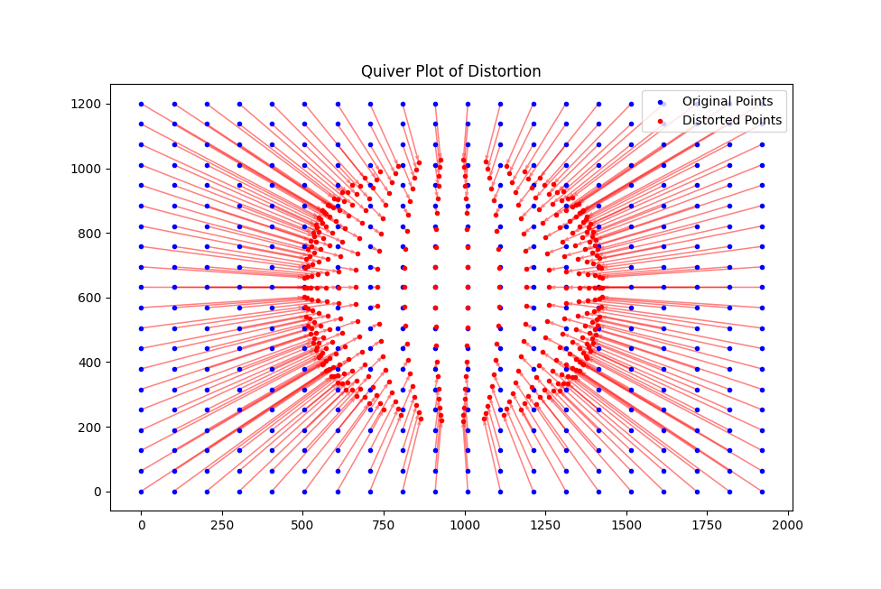
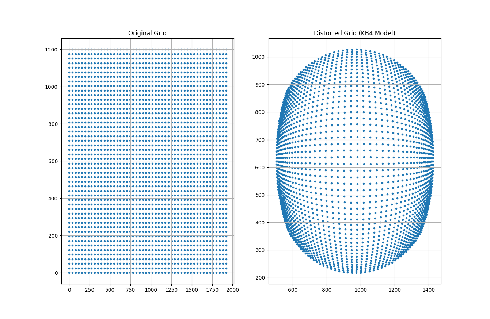

# Reflection
This assessment was very insightful, as I got to understand how pinhole cameras
work under the hood, and the calibration that takes place in such cameras to correct the significant
distortion effects that come with it. I learnt that, with some remapping and calibration plates (the chess board lookalike) 
we can correct the distortion effect and also determine the relation between real world units and camera's "units". (Like the
one showed to me during the interview)

I focused on the Kannala-Brandt (KB4) model, which is a popular choice for fisheye camera calibration. 
The objective was to visualize the distortion effect from a perfect pinhole camera to a fisheye camera by plotting the original and distorted points.
The KB4 model uses eight parameters: fx, fy, cu, cv, k1, k2, k3, and k4. These parameters define the
radial and tangential distortions in the camera, which can be utilized to "undistort" the images. 

I first normalized the image coordinates to the camera coordinate system by subtracting the principal point and dividing by the focal lengths. 
Then, I calculated the radial distance and angle for each point, which I used to compute the distorted points based on the [KB4 model equations](https://users.aalto.fi/~kannalj1/calibration/Kannala_Brandt_calibration.pdf)
Finally, I converted the distorted points back to pixel coordinates. 

To visualize the distortion effect, I generated both a quiver plot and a regular grid plot, which depicts the direction and magnitude 
of distortion from the original points to the distorted points. The quiver plot demonstrates
the fisheye distortion, with an inward contraction of the points in the distorted image. 
I found it really interesting that the methodology used can be applied to other calibration models 
or to correct distortions in real-world images by following the inverse transformation process.

## Quiver Plot

## Grid Plot

# Resources used
- [OpenCV Camera calibration demo](https://amroamroamro.github.io/mexopencv/opencv/calibration_demo.html)
- [Original KB4 Paper](https://users.aalto.fi/~kannalj1/calibration/Kannala_Brandt_calibration.pdf)
